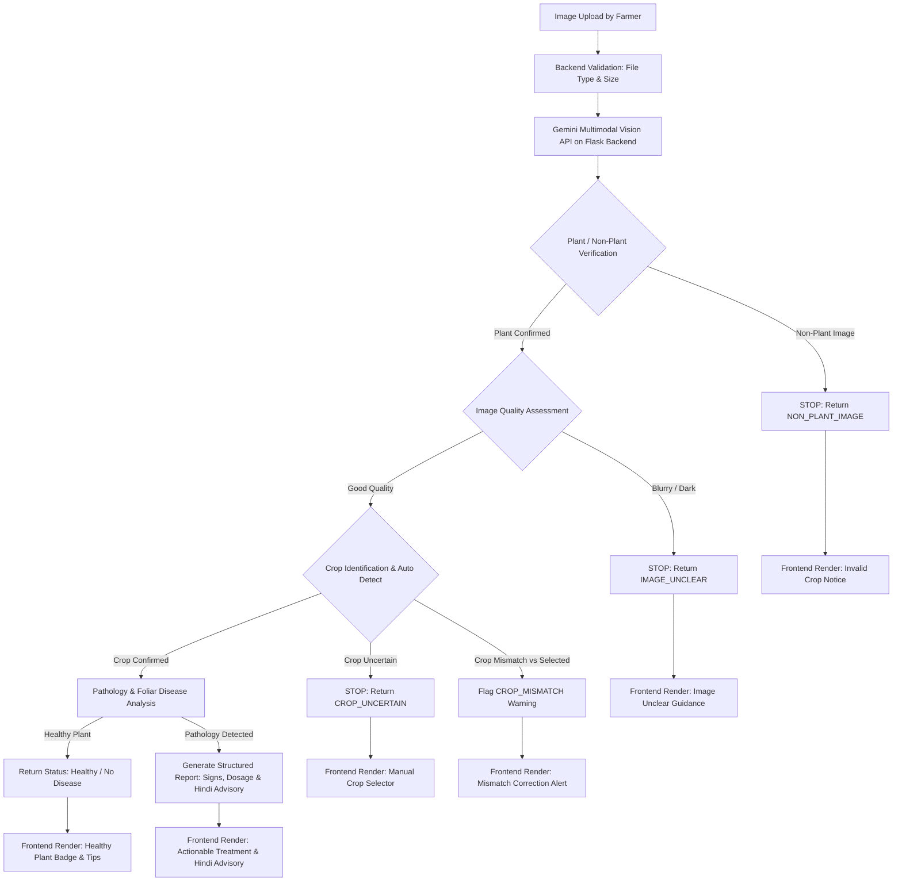
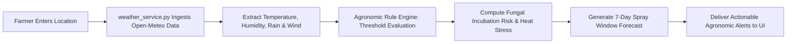
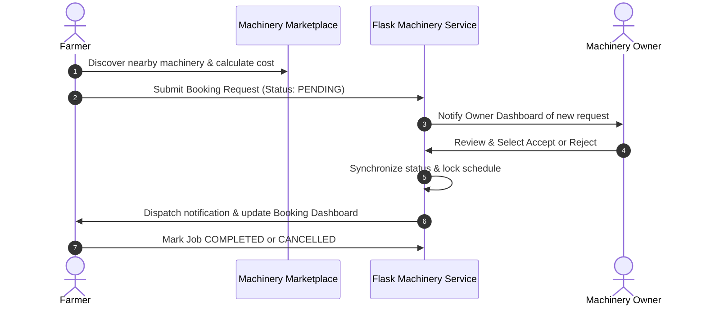

# AGRO-SMART System Architecture

**Smart Farming. Smarter Decisions. Better Harvests.**

---

## 1. Architecture Overview

AGRO-SMART follows a modular, decoupled full-stack architecture designed to handle visual AI processing, meteorological risk computation, equipment booking workflows, and commodity market pricing:

```text
User (Farmer / Machinery Owner / Admin)
                 │
                 ▼
┌─────────────────────────────────────────────────────────────┐
│                 React + Vite Frontend (SPA)                 │
│  - Responsive Light Theme UI (Tailored Tokens & Accessible) │
│  - Centralized Client Service Layer (src/services/)         │
└──────────────────────────────┬──────────────────────────────┘
                               │ HTTP / JSON / multipart/form-data
                               ▼
┌─────────────────────────────────────────────────────────────┐
│                 REST API Layer (Flask Blueprints)           │
│  - Modular Route Separation (/api/auth, /api/disease, etc.) │
│  - Input Validation, Safe CORS & Sanitized Error Handlers   │
└──────────────────────────────┬──────────────────────────────┘
                               │
                               ▼
┌─────────────────────────────────────────────────────────────┐
│                 Backend Service Layer                       │
│  - gemini_disease_service.py  • weather_service.py          │
│  - machinery_service.py       • market_service.py           │
│  - auth_service.py            • notification_service.py     │
└──────────────────────────────┬──────────────────────────────┘
                               │
                               ▼
┌─────────────────────────────────────────────────────────────┐
│                 External & Data Services                    │
│  - Google Gemini Multimodal Vision API                      │
│  - Open-Meteo Hyperlocal Agro-Weather API                   │
│  - AgMarket / APMC Mandi Price Feeds                        │
│  - Supabase PostgreSQL / In-Memory Demo Data Layer          │
└─────────────────────────────────────────────────────────────┘
```

---

## 2. Frontend Layer

- **Framework & Tooling**: Built with **React 18** and **Vite**, featuring fast Hot Module Replacement (HMR) and optimized static production builds.
- **Client Service Layer (`src/services/`)**: Centralized HTTP abstractions (`api.js`, `diseaseService.js`, `weatherService.js`, `machineryService.js`, `marketService.js`, `authService.js`, `notificationService.js`) encapsulate network requests and decouple UI views from API protocols.
- **Multi-Role User Flows**:
  - **Farmer Flow**: Access to crop pathology scanning, hyperlocal weather risk alerts, machinery rental bookings, mandi price discovery, and personal notification inbox.
  - **Machinery Owner Flow**: Dedicated owner dashboard for registering tractors/implements, setting hourly rental rates, managing inbound booking requests, and tracking utilization status.
  - **Admin Flow**: System-wide administrative oversight over registered accounts, active machinery listings, and platform-wide booking audit trails.
- **Responsive Interface**: Custom CSS3 design tokens crafted specifically for high-contrast visibility, mobile responsiveness, and intuitive navigation in rural agricultural settings.

---

## 3. Backend Layer

- **Web Framework**: **Python 3 Flask** application configured with modular Flask Blueprints.
- **Route Separation (`backend/routes/`)**:
  - `auth_routes.py`: Session creation, registration, and role validation.
  - `disease_routes.py`: Multipart image reception, Auto Crop routing, and scan history.
  - `weather_routes.py`: Hyperlocal forecast requests and agronomic risk evaluation.
  - `machinery_routes.py`: Machinery inventory catalog and booking lifecycle status transitions.
  - `market_routes.py`: APMC commodity spot price endpoints and trend analytics.
  - `admin_routes.py`: Admin statistics and platform management.
- **Service Layer (`backend/services/`)**: Encapsulates core business logic, pathology prompt engineering, agronomic rule evaluations, and data transformation away from route controllers.
- **Authentication & Security**: Role-based route protection, strict input sanitization, safe CORS origin constraints, and server-side secret management via `python-dotenv`.
- **Validation & Error Handling**: Strict file format (`JPG`, `PNG`, `WEBP`, `BMP`) and size limits ($\le 10\text{ MB}$), with descriptive, safe JSON error responses that never leak raw stack traces or internal secrets.

---

## 4. AI Disease Detection Flow



---

## 5. Weather Intelligence Flow



---

## 6. Machinery Booking Flow



---

## 7. Market Intelligence Flow


---

## 8. Data Layer & Persistence Architecture

- **Supabase-Compatible Relational Schema**:
  - The database layer is modeled with normalized PostgreSQL tables:
    - `users` (Farmer, Machinery Owner, Admin profiles and role permissions)
    - `disease_scans` (Pathology diagnostic logs and image scan metadata)
    - `weather_checks` (Cached hyperlocal meteorological query logs)
    - `machinery` (Equipment listings, specifications, and hourly pricing)
    - `bookings` (Rental lifecycle states, date ranges, and status history)
    - `market_prices` (APMC mandi records and commodity price observations)
- **Local / Demo Dual-Mode Operation**:
  - **Prototype & Hackathon Demo Mode**: When Supabase credentials are not connected or during offline hackathon demonstrations, the backend automatically utilizes thread-safe in-memory stores. This guarantees complete, uninterrupted application workflows without requiring external database dependencies.
  - **Production Ready**: When `SUPABASE_URL` and `SUPABASE_KEY` are provided in `backend/.env`, the data layer transparently connects to live Supabase PostgreSQL instances without changing application routes or frontend contracts.

---

## 9. Modular Extensibility

By strictly decoupling the **React Frontend**, **Flask REST Route Controllers**, and **Service Adapters**, AGRO-SMART ensures third-party dependencies (Gemini Vision API, Open-Meteo, APMC price feeds, payment gateways, and authentication providers) can be upgraded, replaced, or mocked with zero disruption to the overall system design.
