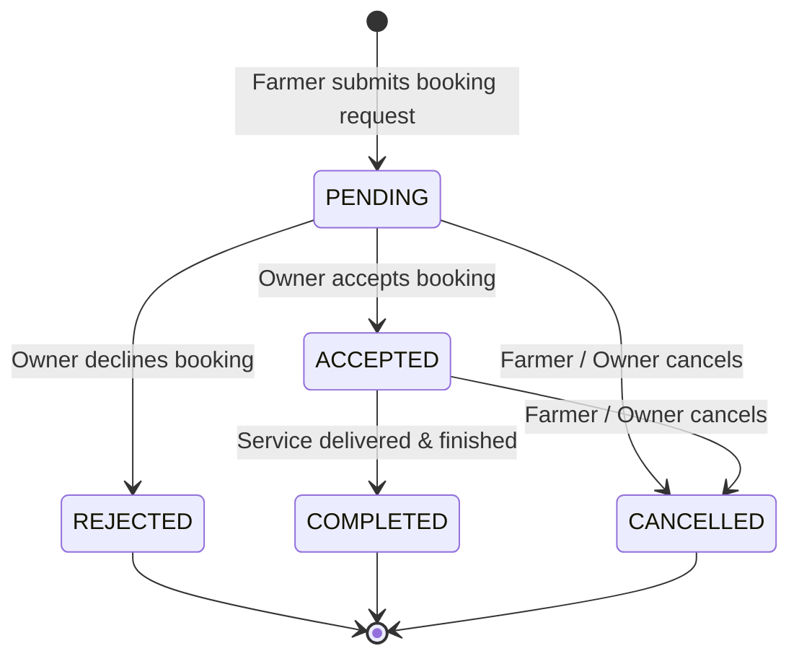

# Machinery Marketplace & Booking System

**On-Demand Agricultural Equipment Sharing & Mechanization Platform**

---

## 1. Purpose

Small and marginal farmers often cannot afford high-capital agricultural machinery such as heavy tractors, multi-crop combine harvesters, laser levelers, and automatic seed drills. Conversely, equipment owners face underutilization during off-peak windows.

The **AGRO-SMART Machinery Marketplace ("Uber for Tractors")** bridges this gap by connecting farmers requiring seasonal field mechanization with nearby machinery owners for transparent, hourly-rate equipment rentals.

---

## 2. User Roles & Capabilities

### Farmer
- **Browse & Filter Machinery**: Search agricultural equipment by machine type (*Tractor, Harvester, Rotavator, Cultivator, Seed Drill*), location, keyword, or max distance.
- **Inspect Machine Specifications**: Review horsepower (HP), hourly rates, daily rates, user ratings, operational features, and owner contact details.
- **Submit Booking Requests**: Select service dates, start times, estimated duration (1–48 hours), and enter farm location.
- **Track Status & History**: Monitor booking lifecycle updates (`PENDING`, `ACCEPTED`, `REJECTED`, `COMPLETED`, `CANCELLED`) in real-time from the Farmer Dashboard.

### Machinery Owner
- **View Equipment Listings**: Inspect registered machinery inventory with specifications, rates, and availability badges.
- **Receive Booking Inquiries**: Review inbound rental requests in the Owner Dashboard with farmer contact details, farm location, scheduled date, and projected revenue.
- **Accept / Reject Requests**: Confirm or decline rental bookings directly with one click.
- **Manage Equipment Utilization**: Track active schedules and historical rental earnings.

### Admin
- **Platform Oversight**: Audit platform-wide machinery listings, booking logs, and active equipment reservations across all registered users.

---

## 3. Marketplace Flow

```text
Farmer
  │
  ▼
Browse & Filter Machinery Catalog
  │
  ▼
Select Machine & Review Specifications
  │
  ▼
Submit Booking Form (Date, Duration, Location & Phone)
  │
  ▼
Server-Side Double-Booking & Rate Validation
  │
  ▼
Booking Created with Status: PENDING
  │
  ▼
Owner Receives Booking Alert in Dashboard
  │
  ▼
Owner Action: ACCEPT or REJECT
  │
  ▼
Booking Status Synchronized across System
  │
  ▼
Farmer Dashboard Displays Updated Status & Notification
```

---

## 4. Booking Status Lifecycle

The system enforces a clean, deterministic 5-stage status lifecycle:



### Supported Status Codes
1. **`PENDING`**: Initial state upon booking creation awaiting owner response.
2. **`ACCEPTED`**: Confirmed by the machinery owner; schedule is reserved.
3. **`REJECTED`**: Declined by the owner (e.g. maintenance or personal use).
4. **`COMPLETED`**: Farming operation successfully concluded.
5. **`CANCELLED`**: Cancelled prior to service execution.

---

## 5. Role-Based Booking Logic

Both Farmers and Machinery Owners interact with the **same underlying booking entity**, with role-tailored perspectives:

| Context | Farmer View | Machinery Owner View |
| :--- | :--- | :--- |
| **Primary Focus** | Equipment name, type, hourly rate, and owner phone | Client name, contact phone, farm location, and total earnings |
| **Financial Metric**| Total Estimated Rental Cost (₹) | Total Projected Revenue (₹) |
| **Actionable Controls**| `Cancel Booking` (if pending/accepted) | `Accept Booking`, `Reject Booking`, `Mark Completed` |
| **Notification Triggers**| Receives alert when owner accepts/rejects | Receives alert when new booking is created |

---

## 6. Backend Architecture

```text
┌─────────────────────────────────────────────────────────────┐
│          Frontend Client Layer (React 18 + Vite)            │
│  - MachineryRentalPage.jsx  • FarmerDashboardPage.jsx       │
│  - OwnerDashboardPage.jsx   • machineryService.js           │
└──────────────────────────────┬──────────────────────────────┘
                               │ REST POST / GET / PATCH
                               ▼
┌─────────────────────────────────────────────────────────────┐
│          Flask Machinery Routes (machinery_routes.py)       │
│  - GET  /api/machinery          [List & filter catalog]     │
│  - GET  /api/machinery/<id>     [Equipment details]         │
│  - POST /api/machinery/book     [Create booking request]    │
│  - GET  /api/machinery/bookings [Fetch shared bookings]     │
│  - PATCH/POST /status           [Update lifecycle status]   │
└──────────────────────────────┬──────────────────────────────┘
                               │
                               ▼
┌─────────────────────────────────────────────────────────────┐
│          Machinery Service Layer (machinery_service.py)     │
│  - check_double_booking()       [Overlap prevention]        │
│  - create_booking()             [Rate & duration calculation│
│  - update_booking_status()      [State machine transitions] │
└──────────────────────────────┬──────────────────────────────┘
                               │
                               ▼
┌─────────────────────────────────────────────────────────────┐
│          Data Persistence (Supabase / In-Memory Demo)       │
│  - MACHINERY_STORE  • BOOKINGS_STORE                        │
└─────────────────────────────────────────────────────────────┘
```

---

## 7. Supported Machinery Fields

The application supports structured equipment records with the following fields:

- **`id`**: Unique listing identifier (e.g. `eq-101`).
- **`machine_name`**: Brand and model (e.g. `Mahindra 575 DI Power Plus`).
- **`machine_type`**: Equipment classification (`Tractor`, `Harvester`, `Rotavator`, `Cultivator`, `Seed Drill`).
- **`horse_power`**: Engine rating (HP) for workload assessment.
- **`price_per_hour`**: Standard hourly rental rate in ₹.
- **`price_per_day`**: Daily 8-hour shift discount rate in ₹.
- **`rating` & `reviews_count`**: Aggregated farmer feedback score and count.
- **`distance_km`**: Proximity indicator relative to the search query.
- **`location`**: Agricultural district/state string (e.g. `Pune Rural, Maharashtra`).
- **`owner_id`, `owner_name`, `owner_phone`**: Equipment owner contact details.
- **`availability`**: Current operational status (`Available`).
- **`features`**: Specific capability tags (e.g. `Power Steering`, `Rotavator Ready`, `4WD`).
- **`badge`**: Highlight tag (`Popular`, `Top Rated`, `Best Value`, `Heavy Duty`).

---

## 8. Booking Validation & Protections

1. **Mandatory Field Validation**: Verifies `farmer_name`, `phone`, `service_location`, and `booking_date` are non-empty.
2. **Duration Boundaries**: Enforces minimum 1.0 hour and maximum 48.0 hours per single rental reservation.
3. **Double-Booking Prevention**:
   - The backend executes `check_double_booking(machinery_id, booking_date)` before accepting any reservation.
   - If an overlapping active booking (`PENDING` or `ACCEPTED`) already exists for that equipment on the requested date, the submission is rejected with:
     `"This machine is already booked for the selected time."`

---

## 9. Demo Mode & Dual-Mode Persistence

- **In-Memory Store (`MACHINERY_STORE` / `BOOKINGS_STORE`)**:
  - In local demo mode, all listings and booking state transitions are stored in synchronized, thread-safe memory collections.
  - State changes (e.g. owner accepting a booking) reflect immediately in farmer dashboards and notification counters during live demonstration.
- **Supabase-Compatible Schema**:
  - Ready for production PostgreSQL deployment (`machinery` and `bookings` tables) without rewriting route controllers or UI components.

---

## 10. Business Value & Agricultural Impact

- **Democratizing Farm Mechanization**: Enables smallholders to utilize advanced combine harvesters and rotavators on an hourly basis, reducing labor dependency and shortening harvest windows.
- **Asset Monetization**: Turns idle tractors and implements into recurring income streams for machinery owners.
- **Reduced Capital Debt**: Minimizes the need for small farmers to take high-interest agricultural equipment loans.

---

## 11. Future Improvements & Roadmap

1. **GPS-Based Nearby Discovery**: Real-time geolocation distance sorting using live device GPS coordinates.
2. **Hourly Slot Booking Calendar**: Interactive visual calendar supporting morning/afternoon/night hourly slot selection.
3. **Owner KYC & Implement Verification**: Document verification for equipment fitness and RC books.
4. **In-App Rating & Review Submission**: Post-service farmer rating and text review submission pipeline.
5. **Integrated UPI Escrow Payments**: In-app digital payment holding funds in escrow until the farmer confirms job completion.
6. **Distance-Based Transit Surcharge**: Automated transportation freight pricing for distant farm plots.
7. **Equipment Breakdown Insurance**: Integrated micro-insurance protecting against implement damage during rental hours.

---

## 12. Important Technical Notes for Evaluation

- **Decoupled Architecture**: UI components do not mutate data directly; all booking transitions execute through backend REST endpoints enforcing server-side rate verification and status validation.
- **Shared Synchronized State**: Status updates initiated by the machinery owner immediately update the farmer's booking status and trigger contextual notification alerts.
