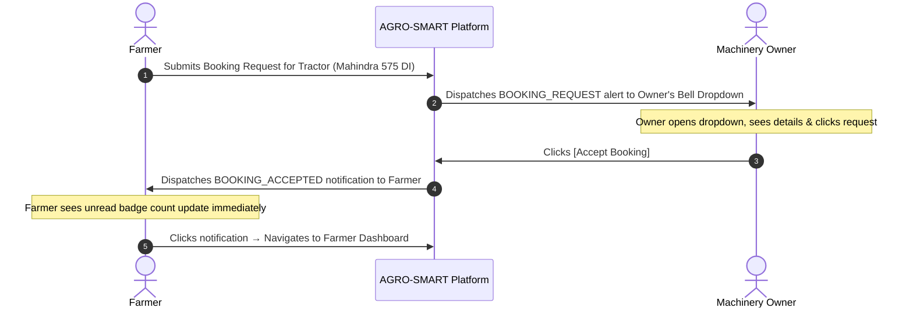

# AGRO-SMART Notification System

**In-App Alerts, Role-Specific Notifications & Event Synchronization**

---

## 1. Purpose

The **AGRO-SMART Notification System** keeps **Farmers**, **Machinery Owners**, and **Administrators** informed in real time about critical domain events across the platform. 

Whether a machinery owner confirms a tractor rental, a high-humidity fungal weather risk emerges, or an AI crop diagnostic finishes, notifications ensure stakeholders receive immediate, actionable updates without needing to manually refresh pages.

---

## 2. Notification Architecture

```text
Domain System Event (Booking created, owner accepts, weather check, disease scan)
                               │
                               ▼
Client Service Layer / Business Logic (notificationService.js)
                               │
                               ▼
Notification Record Assembly (User ID, Type, Severity, Title, Body, Action URL)
                               │
                               ▼
Persistent Local Store (localStorage: 'agro_smart_notifications')
                               │
                               ▼
Cross-Component Event Broadcast (window.dispatchEvent('agro_smart_notifications_updated'))
                               │
                               ▼
Navbar Bell Badge & Unread Counter Listener
                               │
                               ▼
Interactive Dropdown Menu & Role Dashboard Integration
```

---

## 3. Supported Notification Types

The following 9 notification types are verified and actively implemented in the application:

| Notification Type | Primary Recipient | Severity | Trigger Event |
| :--- | :--- | :--- | :--- |
| **`BOOKING_REQUEST`** | Machinery Owner | `info` | A farmer submits a new equipment rental booking request. |
| **`BOOKING_ACCEPTED`** | Farmer | `success` | A machinery owner accepts the farmer's rental booking. |
| **`BOOKING_REJECTED`** | Farmer | `error` | A machinery owner declines the rental booking. |
| **`BOOKING_CANCELLED`**| Machinery Owner | `warning` | A farmer cancels an existing pending or accepted booking. |
| **`BOOKING_COMPLETED`**| Farmer | `success` | A machinery owner marks the rental job as completed. |
| **`WEATHER_ALERT`** | Farmer | `warning` | `HIGH` or `CRITICAL` agro-meteorological disease/heat risk detected. |
| **`DISEASE_ANALYSIS`** | Farmer | `info` / `warning` | Gemini AI foliar pathology diagnostic analysis completes. |
| **`MARKET_ALERT`** | Farmer | `info` | APMC mandi price trends suggest an optimal selling window. |
| **`ADMIN_ACTIVITY`** | Administrator | `info` | System-wide administrative event (e.g. new owner registration). |

---

## 4. Machinery Booking Notification Flow



---

## 5. Farmer Notifications

Farmers receive targeted notifications relating to their active farm operations:
- **Booking Status Changes**: Real-time alerts when equipment owners accept, reject, or mark bookings as completed.
- **Pathology Scan Results**: Instant notice when uploaded leaf photos finish AI diagnostic processing, summarizing the identified disease and severity.
- **Weather Hazards**: Automated warnings for high humidity or heat stress endangering specific crops.
- **Market Opportunities**: Alerts when wholesale mandi prices exhibit strong upward price momentum.

---

## 6. Machinery Owner Notifications

Machinery Owners receive business-critical alerts to manage their rental operations:
- **New Inbound Inquiries**: Detailed notification with client farmer name, phone number, machine requested, scheduled date, and total estimated rental fee.
- **Booking Cancellations**: Notice when a farmer cancels a reservation, immediately freeing up the equipment for other farmers.

---

## 7. Admin Notifications

The Administrator account receives platform-wide oversight notifications:
- **System Activity Alerts**: Informs the admin when new machinery owners register equipment fleets, providing one-click navigation to the Admin Dashboard for user and listing moderation.

---

## 8. Weather Alert Notifications

- **Agronomic Trigger**: When a farmer searches a crop and location that evaluates to **`HIGH`** or **`CRITICAL`** risk (e.g. Late Blight conditions in Tomato or Blast conditions in Rice), `notifyWeatherRisk()` creates a `WEATHER_ALERT` notification.
- **Deduplication Engine**: To prevent spamming the user's notification list, the service checks whether an identical weather alert for the same crop and location was created within the last **3 hours**; duplicate alerts are automatically suppressed.
- **Deep Linking**: Clicking the weather notification navigates directly to `/weather-intelligence` to view full spraying and harvesting advisories.

---

## 9. Notification Data Structure

Every notification object adheres to a standardized schema:

```json
{
  "id": "notif-1724217600-a1b2c3",
  "user_id": "usr-demo-farmer-01",
  "type": "BOOKING_ACCEPTED",
  "title": "Booking Accepted: Mahindra 575 DI Power Plus",
  "message": "Your booking for Mahindra 575 DI on 2026-08-25 has been accepted by Suresh Singh Machinery.",
  "severity": "success",
  "read": false,
  "related_entity_type": "booking",
  "related_entity_id": "bk-init-101",
  "action_url": "/dashboard",
  "created_at": "2026-08-21T02:00:00.000Z"
}
```

---

## 10. Read / Unread State Management

The notification service provides comprehensive state management methods:
- **`getUnreadCount(userId)`**: Computes the number of unread notifications for the active user session.
- **`markAsRead(notificationId)`**: Marks a single notification as read when clicked.
- **`markAllAsRead(userId)`**: Bulk updates all unread notifications to `read: true`.
- **`deleteNotification(notificationId)`**: Removes an individual notification item.
- **`clearReadNotifications(userId)`**: Purges all read notifications from storage.

---

## 11. Real-Time Behavior & Delivery Mechanism

- **State & Storage Synchronization**: Notifications are persisted in `localStorage` under `agro_smart_notifications`.
- **Cross-Component Events**: Mutating notification state dispatches a custom `agro_smart_notifications_updated` window event, instantly updating the Navbar badge counter, dropdown items, and dashboard lists without page reloads.
- **Native Browser Notifications**: Features an opt-in web browser notification trigger (`Notification.requestPermission()`) displaying desktop system alerts when permission is granted.
- **Zero Heavy Infrastructure**: Operates cleanly without requiring external WebSocket servers or push services for prototype evaluation.

---

## 12. Demo Mode vs. Production Architecture

- **Current Prototype Implementation**:
  - Seeded with pre-configured demo notifications (`INITIAL_DEMO_NOTIFICATIONS`) for the demo Farmer, Machinery Owner, and Admin accounts.
  - Allows complete stateful demonstration of booking workflows (Farmer creates booking $\rightarrow$ Owner receives notification in dropdown $\rightarrow$ Owner accepts $\rightarrow$ Farmer receives acceptance alert).
- **Target Production Architecture**:
  - Transition to database-backed relational notification tables with asynchronous push broker delivery.

---

## 13. Future Notification Architecture (Roadmap)

1. **Persistent Database Storage**: Sync notification records with a Supabase `notifications` table.
2. **Push Notifications (FCM / Web Push API)**: Mobile and background browser push notifications when the application tab is closed.
3. **SMS Alerts via Twilio / Fast2SMS**: Critical SMS text messages for rural farmers with feature phones.
4. **WhatsApp Business Messaging**: Automated PDF diagnostic reports and booking confirmations dispatched to farmer WhatsApp numbers.
5. **WebSocket / Server-Sent Events (SSE)**: Dedicated real-time socket connection for instant multi-device synchronization.
6. **Severe Weather Emergency Push**: Push broadcasts for flash floods, hailstorms, or severe frost warnings.

---

## 14. Jury Technical Explanation

> *"How does your notification system work?"*

```text
Domain Event (e.g. Booking Created or Owner Action)
                      │
                      ▼
notificationService Method (notifyBookingRequest, notifyBookingAccepted, etc.)
                      │
                      ▼
Schema Construction & Storage in localStorage
                      │
                      ▼
window.dispatchEvent('agro_smart_notifications_updated')
                      │
                      ▼
Navbar Bell Icon & Unread Counter React State Updates
                      │
                      ▼
User Clicks Notification → Interactive Navigation to Action URL
```

---

## 15. Important Technical Limitations

1. Notifications are currently scoped to the local browser `localStorage`; switching browsers or devices in demo mode does not synchronize notification history.
2. If the user clears browser cache/storage, notifications reset to the initial seed state.
3. External delivery channels (SMS, WhatsApp, Email, Firebase Push) are currently in roadmap status and not active in the prototype.
